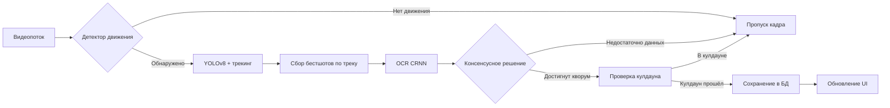

# ANPR System - Automatic Number Plate Recognition


Десктопное приложение для автоматического распознавания автомобильных номеров с поддержкой многоканального видео, локальной базой данных и интеллектуальной обработкой в реальном времени.

## 🚀 Основные возможности

- **Многоканальный мониторинг** — одновременная работа с несколькими видеопотоками (RTSP/файлы)
- **Адаптивная детекция движения** — умный запуск распознавания только при наличии движения в зоне интереса (ROI)
- **Трекинг и агрегация** — отслеживание объектов с голосованием по лучшим кадрам для повышения точности
- **Локальное хранение** — SQLite база событий с автоматическим созданием скриншотов
- **Гибкие настройки** — индивидуальная конфигурация для каждого канала
- **Автоматическое восстановление** — переподключение при потере сигнала
- **CLI-интерфейс** — инструмент для пакетной обработки изображений и видео

## 📦 Установка

### Предварительные требования
- Python 3.8 или выше
- pip (менеджер пакетов Python)

### Установка зависимостей

```bash
# Клонирование репозитория
git clone <repository-url>
cd ANPR-System-v0.3

# Установка базовых зависимостей
pip install -r requirements.txt

# Установка PyTorch (выберите вариант под ваше железо)

# Для CPU:
pip install torch==2.8.0 torchvision==0.23.0 torchaudio==2.8.0 --index-url https://download.pytorch.org/whl/cpu

# Для CUDA 11.8:
pip install torch==2.8.0 torchvision==0.23.0 torchaudio==2.8.0 --index-url https://download.pytorch.org/whl/cu118

# Для CUDA 12.1:
pip install torch==2.8.0 torchvision==0.23.0 torchaudio==2.8.0 --index-url https://download.pytorch.org/whl/cu121
```

## 🎮 Быстрый старт

### Графический интерфейс
```bash
python app.py
```

### Командный интерфейс (CLI)
```bash
# Обработка изображения
python anpr_cli.py --image path/to/image.jpg

# Обработка видеофайла
python anpr_cli.py --video path/to/video.mp4

# С веб-камеры
python anpr_cli.py --camera 0
```

## 🖥️ Интерфейс приложения

### 1. Вкладка "Наблюдение"
- **Сетка просмотра** — выбор компоновки (1×1, 1×2, 2×2, 2×3, 3×3)
- **Панель каналов** — отображение видеопотоков (занимает 3/4 ширины)
- **Последнее событие** — предпросмотр недавно распознанного номера
- **Детали события** — полная информация о выбранном событии
- **Таблица событий** — 100 последних распознаваний с фильтрацией

### 2. Вкладка "Поиск"
- **Поиск по номеру** — поддержка частичного совпадения
- **Фильтр по времени** — выбор интервала дат
- **Просмотр скриншотов** — прикреплённые изображения событий

### 3. Вкладка "Настройки"
- **Общие настройки**:
  - Автоматическое переподключение
  - Пути к БД и скриншотам
  - Сетка по умолчанию
  - Параметры логирования

- **Настройки каналов**:
  - Источники видео (RTSP/файлы)
  - Зоны интереса (ROI)
  - Параметры распознавания
  - Детектор движения
  - Консенсусное распознавание

## 🏗️ Архитектура системы

```
┌─────────────────────────────────────────────┐
│ Presentation Layer (GUI/CLI)                │ ← main_window.py, app.py, anpr_cli.py
├─────────────────────────────────────────────┤
│ Application Layer (Coordinators)            │ ← channel_worker.py, factory.py
├─────────────────────────────────────────────┤
│ Domain Layer (Core Business Logic)          │ ← anpr_pipeline.py, aggregator.py
├─────────────────────────────────────────────┤
│ Infrastructure Layer (External Services)    │ ← yolo_detector.py, crnn_recognizer.py
└─────────────────────────────────────────────┘
```

## 🔧 Технологический стек

### Детекция номеров
- **YOLOv8** — нейросеть для обнаружения номерных знаков
- **ByteTrack** — алгоритм трекинга объектов
- **Автоматический откат** — при ошибках трекера используется чистая детекция

### Распознавание текста
- **CRNN (INT8-квантизация)** — свёрточная рекуррентная сеть для OCR
- **Препроцессинг** — коррекция перспективы, шумоподавление, бинаризация
- **Вероятность OCR** — оценка уверенности в распознавании (0..1)

### Оптимизации
- **Адаптивный инференс** — шаг обработки кадров для снижения нагрузки
- **Консенсусное распознавание** — голосование по нескольким кадрам
- **Подавление повторов** — таймер кулдауна для одинаковых номеров

## 📊 Процесс обработки



## ⚙️ Конфигурация

### Параметры трекинга (настраиваются для каждого канала)
```json
{
  "best_shots": 5,           // Количество кадров для голосования
  "cooldown_seconds": 30,    // Время подавления повторов
  "ocr_min_confidence": 0.7, // Минимальная уверенность OCR
  "detector_step": 3         // Шаг инференса детектора
}
```

### Детектор движения
- **Частота анализа** — обработка каждого N-го кадра
- **Порог срабатывания** — минимальная площадь изменений
- **Гистерезис** — кадры для включения/выключения режима

## 💾 Хранение данных

- **База данных** — SQLite (`data/db/anpr.db` по умолчанию)
- **Схема таблицы**:
  - `id` — уникальный идентификатор
  - `plate_number` — распознанный номер
  - `channel_id` — идентификатор канала
  - `frame_path` — путь к полному кадру
  - `crop_path` — путь к кропу номера
  - `timestamp` — время события (UTC)
  - `confidence` — уверенность распознавания

- **Скриншоты** — автоматическое сохранение в настраиваемую папку
- **Асинхронная запись** — не блокирует видеопотоки

## 📁 Структура проекта

```
ANPR-System-v0.3/
├── app.py                    # Точка входа (GUI)
├── anpr_cli.py              # Командный интерфейс
├── requirements.txt         # Зависимости Python
├── settings.json           # Конфигурация приложения
│
├── anpr/                   # Основной пакет
│   ├── __init__.py
│   ├── config.py           # Константы и настройки
│   │
│   ├── detection/          # Детекция объектов
│   │   ├── __init__.py
│   │   ├── yolo_detector.py    # YOLOv8 детектор
│   │   └── motion_detector.py  # Детектор движения
│   │
│   ├── pipeline/           # Пайплайн обработки
│   │   ├── __init__.py
│   │   ├── anpr_pipeline.py    # Основной пайплайн
│   │   └── factory.py          # Фабрика компонентов
│   │
│   ├── recognition/        # Распознавание текста
│   │   ├── __init__.py
│   │   ├── crnn.py             # Архитектура CRNN
│   │   └── crnn_recognizer.py  # OCR-движок
│   │
│   ├── ui/                 # Пользовательский интерфейс
│   │   ├── __init__.py
│   │   └── main_window.py      # Главное окно PyQt5
│   │
│   └── workers/            # Фоновые процессы
│       ├── __init__.py
│       └── channel_worker.py   # Обработчик каналов
│
├── data/                   # Данные приложения
│   ├── db/                # База данных SQLite
│   └── screenshots/       # Скриншоты событий
│
└── utils/                 # Вспомогательные модули
    ├── logging_manager.py    # Менеджер логирования
    ├── settings_manager.py   # Управление настройками
    └── storage.py            # Работа с БД
```

## 🛠️ Разработка

### Принципы проектирования
- **SOLID** — разделение ответственности между компонентами
- **DRY** — отсутствие дублирования кода
- **KISS** — простота реализации и поддержки
- **ООП** — объектно-ориентированный подход

### Логирование
- Ротация лог-файлов через `RotatingFileHandler`
- Настраиваемые уровни детализации
- Раздельные логгеры для разных компонентов

## 🔍 Поиск и фильтрация

1. **По номеру** — поддержка частичного совпадения (LIKE)
2. **По времени** — точный интервал или относительные периоды
3. **По каналу** — фильтрация по источнику видео
4. **По уверенности** — отбор по минимальному порогу OCR

## ⚠️ Ограничения

- Требует предобученных моделей YOLOv8 и CRNN
- Работает только с номерами российского стандарта
- Для RTPS-потоков требуется стабильное сетевое соединение
- Высокая нагрузка при работе с большим количеством каналов

## 📄 Лицензия

[Укажите лицензию вашего проекта]

## 🤝 Вклад в проект

1. Форкните репозиторий
2. Создайте ветку для новой функциональности
3. Внесите изменения
4. Добавьте тесты
5. Отправьте pull request

## 📞 Поддержка

По вопросам использования и проблемам создавайте Issues в репозитории проекта.